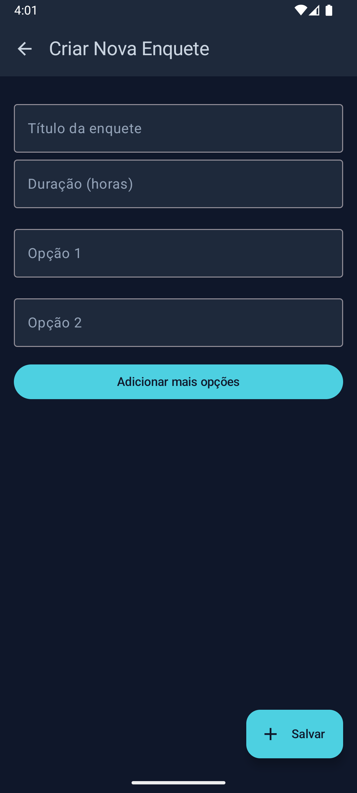
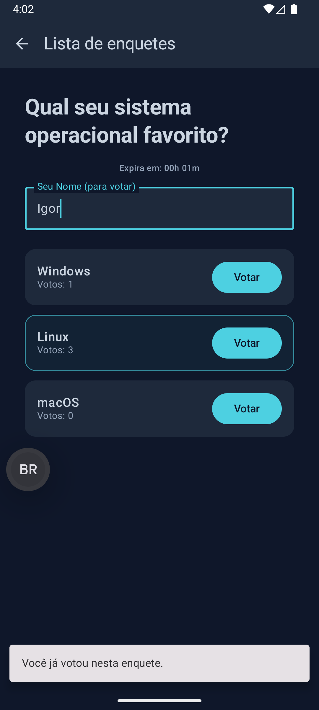

# 🧪 Pollab - Mobile App · [Play Store](https://pollab-web.netlify.app/)


**About Pollab**

**Pollab** (*Poll Laboratory*) is an open-source, real-time polling platform built with a modern 
tech stack to simplify how people gather opinions and make decisions. 

The **Pollab mobile app** is a native Android client developed with **Kotlin** and **Jetpack Compose**,
powered by a RESTful backend written in Django.

Core features:
- ✨ Minimalist and responsive UI
- ✅ Form validation and feedback
- 📊 Live vote updates with visual indicators
- 🔔 Toast/snackbar alerts for UX clarity
- 🔐 One-vote-per-user enforcement
- ⏱ Poll expiration countdown logic

Whether you're prototyping ideas, running a classroom poll, or testing engagement — Pollab is built to 
**create**, **vote**, and **visualize results in seconds**.
> **Join. Experiment. Transform.**

---

## Screenshots

<p align="center">
  
  
  
</p>

---

## 🛠️ Architecture

| Layer           | Technology                     |
|-----------------|--------------------------------|
| **IDE**         | Android Studio / IntelliJ IDEA |
| **UI**          | Jetpack Compose                |
| **Pattern**     | MVVM (Model-View-ViewModel)    |
| **Network**     | Retrofit · GSON                |
| **Concurrency** | Kotlin Coroutines              |
| **State**       | StateFlow · SharedFlow         |
| **Navigation**  | Navigation Compose             |

### Why These Choices?

- **Jetpack Compose**: A modern, declarative UI toolkit — replaces XML layouts.
- **MVVM**: Separates UI from business logic, recommended by Google.
- **Retrofit**: Clean and type-safe HTTP client.
- **Coroutines**: Simplifies async tasks, avoiding UI blocking.

---

## ⚙️ Setup


### 0. Prerequisites

Make sure you have the following installed:

- [Android Studio](https://developer.android.com/studio) or [IntelliJ IDEA](https://www.jetbrains.com/idea/download/?section=windows) 
- [Java Development Kit (JDK) > 17](https://adoptium.net/en-GB/)
- [Git](https://git-scm.com/)
- Backend API running locall (see: [pollab-backend](https://github.com/igormahall/pollab-backend))
  - Must be accessible via `http://10.0.2.2:8000` for emulators


### 1. Clone the Repository

```bash
git clone https://github.com/igormahall/pollab-mobile.git
cd pollab-mobile
```

### 2. Open in Android Studio
- Launch **Android Studio** or **IntelliJ IDEA**
- Select **Open Project** → choose the project folder
- Let **Gradle** sync all dependencies

### 3. Run the Django Backend
- Ensure the REST API is up and running locally:
  ```bash
  cd pollab-backend
  python manage.py runserver
  ```
> ⚠️ For emulator access, ensure the backend URL is set to http://10.0.2.2:8000/


### 4. Launch the App
- Start an Android emulator or connect a physical device
- Press **Run 'app'** ▶️ in Android Studio

---

## 📐 Project Structure

### 🧩 1. Network & Data Layer

- **Data Models**  
  - Kotlin `data class` objects mirror the JSON schema from the Django API.


- **API Service (Retrofit)**  
  - Interface `ApiService` with annotations like `@GET`, `@POST`, `@Path`, `@Body`


- **Localhost Access**  
  - `http://10.0.2.2:8000/` points to local backend


- **Permissions**  
  - In `AndroidManifest.xml`:
    ```xml
    <uses-permission android:name="android.permission.INTERNET" />
    <application android:usesCleartextTraffic="true" ... /> 
    ```
  
---

### ⚙️ 2. Logic Layer (Repository & ViewModels)

- **Repository Pattern**  
  - `PollRepository` abstracts data fetching from the UI layer.

- **ViewModels** (one per screen):
  - `PollListViewModel`
  - `PollDetailViewModel`
  - `PollFormViewModel`

- **State Management**
  - `StateFlow` : Exposes reactive UI state (loading, success, error).
  - `SharedFlow` : Emits one-time events (snackbars, errors).

- **Concurrency & Safety**  
  - Uses `withContext(Dispatchers.IO)` inside `viewModelScope` to avoid blocking the UI thread

---

### 🎨 3. Presentation Layer (Jetpack Compose UI)

- **Navegation**  
  - Handled via `Navigation Compose` in `AppNavigation.kt`:
  ```kotlin
  navController.navigate("/enquetes/{pollId}")
  ```

- **Composables**
  - `PollListScreen`
  - `PollDetailScreen`
  - `PollFormScreen`


- **Modern UI Components**  
  - `LazyColumn` : Efficient scrolling lists
  - `Card` : For individual pools
  - `OutlinedTextField` : Pool forms
  - `remember { mutableStateOf(...) }` : local UI state

---

### 4. UX Enhancements

- Live countdown until poll expiration
- Highlights winning option dynamically
- Participant name required before voting
- Voting disabled for expired or already-voted polls
- Feedback via SnackbarHost and Toast messages

---

## 🤝 Contributing

We welcome contributions! If you'd like to suggest improvements, report a bug,
or propose new features, feel free to open an issue or submit a pull request.

---

## 📜 License

Distributed under the **MIT License**.
